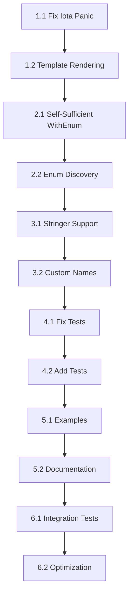

# go-gen-jsonschema: Critical Issues and Implementation TODOs

## Executive Summary

The v1 Options pattern introduced in go-gen-jsonschema is fundamentally broken for enum types. While it works correctly for interface-based unions, the enum-related options (`WithEnum`, `WithEnumMode`, `WithEnumName`) create template files but fail to generate the necessary rendering code, resulting in templates being returned as raw text instead of rendered JSON schemas. Additionally, iota-based enums cause panics when registered globally, and the Options pattern requires redundant global registrations instead of being self-contained.

## Problem Analysis

### 1. Core Issue: Template Rendering Not Implemented for Enum Options

**Location**: `/internal/builder/gen_schema.go` and `/internal/builder/printer.go`

**Current Behavior**:
- When `WithEnum` is used on a field, the system creates a template file (`.json.tmpl`) with placeholders
- The generated `Schema()` method in `jsonschema_gen.go` simply returns the raw template file content
- No rendering logic is generated to substitute the template placeholders with actual enum values

**Example of Broken Output** (`examples/test_options/jsonschema_gen.go:22-30`):
```go
func (Configuration) Schema() json.RawMessage {
    const fileName = "jsonschema/Configuration.json.tmpl"
    data, err := __gen_jsonschema_fs.ReadFile(fileName)
    if err != nil {
        __gen_jsonschema_panic(fileName, err)
    }
    return data  // Returns raw template with {{.log_level}} instead of rendered JSON!
}
```

**What Should Be Generated**:
```go
func (c Configuration) Schema() json.RawMessage {
    // Should render the template with actual field values from receiver 'c'
    // Similar to how provider methods work
}
```

### 2. Iota Enum Panic Issue

**Location**: `/internal/builder/gen_schema.go:454`

**Current Behavior**:
```go
// Line 454 - assumes all enum values are string literals
newValue = strings.Trim(opt.Value().Values[0].(*dst.BasicLit).Value, "\"")
```

**Problem**: 
- Code assumes enum constants are `*dst.BasicLit` (string literals like `"pending"`)
- Iota enums use `*dst.Ident` (identifiers like `iota`)
- Type assertion fails, causing panic: `interface conversion: dst.Expr is *dst.Ident, not *dst.BasicLit`

### 3. Options Pattern Design Flaw

**Current Requirement**:
```go
// Must declare BOTH field-level AND global registration
var _ = jsonschema.NewJSONSchemaMethod(
    WorkItem.Schema,
    jsonschema.WithEnum(WorkItem{}.Priority),  // Field-level
)
var _ = jsonschema.NewEnumType[Priority]()     // Global (redundant!)
```

**Desired Behavior**:
- Field-level `WithEnum` should be sufficient
- No need for separate `NewEnumType` call
- Options should be self-contained

### 4. Missing Stringer Support

**Issue**: Even when enums implement `fmt.Stringer`, the string values aren't used for schema generation

**Example**:
```go
type Color int
const (
    ColorRed Color = iota
    ColorGreen
)
func (c Color) String() string {
    return [...]string{"red", "green"}[c]
}
```
This should generate `{"enum": ["red", "green"]}` when `WithEnumMode(EnumStrings)` is used, but currently fails.

### 5. Documentation Inconsistencies

**Files to Update**:
- `llms.txt` - Contains incorrect examples and instructions
- `README.md` - Suggests using non-existent `cmd` package
- Examples in `examples/` - Mix working and non-working patterns

## Example Programs Demonstrating Each Issue

### Example 1: Iota Enum Panic (`examples/broken/iota_global/`)
**Issue**: Iota enums cause panic when registered globally with `NewEnumType`
```bash
cd examples/broken/iota_global
go run github.com/tylergannon/go-gen-jsonschema/gen-jsonschema
# panic: interface conversion: dst.Expr is *dst.Ident, not *dst.BasicLit
```

### Example 2: Template Not Rendered (`examples/broken/template_rendering/`)
**Issue**: WithEnum creates templates but doesn't generate rendering code
```bash
cd examples/broken/template_rendering
go run github.com/tylergannon/go-gen-jsonschema/gen-jsonschema
# Creates WorkItem.json.tmpl with {{.status}} placeholder
# Schema() returns raw template, not rendered JSON
```

### Example 3: Redundant Registration Required (`examples/broken/self_contained/`)
**Issue**: WithEnum options require additional global enum registrations
```bash
cd examples/broken/self_contained
# Without NewEnumType calls, enums aren't properly generated
# WithEnum should be self-sufficient but isn't
```

### Example 4: Stringer Not Used (`examples/broken/stringer_enum/`)
**Issue**: Stringer implementations ignored, integer values used instead
```bash
cd examples/broken/stringer_enum
# Even with String() method, generates [0,1,2] instead of ["DEBUG","INFO","WARN"]
```

### Example 5: Custom Names Not Applied (`examples/broken/custom_names/`)
**Issue**: WithEnumName doesn't actually map values to custom names
```bash
cd examples/broken/custom_names
# WithEnumName(ColorRed, "red") has no effect
```

## Detailed TODO List and Implementation Sequence

### Phase 1: Fix Critical Infrastructure (Foundation)

#### TODO 1.1: Fix Iota Enum Panic in mapEnumType
**Test with**: `examples/broken/iota_global/`
**File**: `/internal/builder/gen_schema.go:450-460`

**Changes Required**:
```go
// Add type checking before assertion
for _, opt := range enum.Values {
    var newValue string
    switch v := opt.Value().Values[0].(type) {
    case *dst.BasicLit:
        newValue = strings.Trim(v.Value, "\"")
    case *dst.Ident:
        // Handle iota - need to evaluate the constant value
        // This requires constant evaluation logic
        newValue = evaluateConstant(opt)
    default:
        return nil, fmt.Errorf("unsupported enum value type: %T", v)
    }
    // ... rest of logic
}
```

**Sub-tasks**:
1. Implement `evaluateConstant()` function to resolve iota values
2. Add support for detecting and using Stringer implementations
3. Add proper error handling instead of panics

#### TODO 1.2: Implement Template Rendering for WithEnum Options
**Test with**: `examples/broken/template_rendering/`
**Files**: 
- `/internal/builder/printer.go`
- `/internal/builder/gen_schema.go`

**Required Changes**:
1. Detect when a schema uses enum field providers (has `WithEnum` options)
2. Generate provider methods similar to `WithStructAccessorMethod`
3. Implement template rendering in the generated `Schema()` method

**Example Generated Code**:
```go
func (w WorkItem) Schema() json.RawMessage {
    tmpl := // ... load template
    data := map[string]json.RawMessage{
        "priority": w.__enumProvider_Priority(),
        "level": w.__enumProvider_Level(),
    }
    return renderTemplate(tmpl, data)
}

func (WorkItem) __enumProvider_Priority() json.RawMessage {
    // Generate enum schema based on WithEnumMode settings
    if useStringMode {
        return json.Marshal(map[string]interface{}{
            "type": "string",
            "enum": []string{"low", "medium", "high"},
        })
    }
    return json.Marshal(map[string]interface{}{
        "type": "integer", 
        "enum": []int{0, 1, 2},
    })
}
```

### Phase 2: Implement Self-Contained Options Pattern

#### TODO 2.1: Make WithEnum Self-Sufficient
**Test with**: `examples/broken/self_contained/`
**File**: `/internal/builder/builder.go`, `/internal/builder/model.go`

**Changes**:
1. When `WithEnum(field)` is encountered, automatically register the enum type internally
2. Remove requirement for separate `NewEnumType` calls
3. Store enum configuration per-field in the model

#### TODO 2.2: Implement Enum Discovery from Field Options
**File**: `/internal/syntax/scanner.go`

**Changes**:
1. When scanning `WithEnum` options, extract the field type
2. Automatically scan for enum constants of that type
3. Build enum registry from field options instead of requiring global registration

### Phase 3: Enhance Enum Support

#### TODO 3.1: Add Stringer Detection and Support
**Test with**: `examples/broken/stringer_enum/`
**Files**: `/internal/syntax/scanner.go`, `/internal/builder/gen_schema.go`

**Implementation**:
1. Detect if enum type implements `fmt.Stringer`
2. When `WithEnumMode(EnumStrings)` is used with Stringer types:
   - Call `String()` method on each constant value
   - Use returned strings as enum values in schema

#### TODO 3.2: Support Custom Enum Value Mapping
**Test with**: `examples/broken/custom_names/`
**File**: `/internal/builder/gen_schema.go`

**Implementation**:
1. Make `WithEnumName(value, name)` actually work
2. Store custom mappings and apply during schema generation
3. Support both global and per-field custom names

### Phase 4: Fix Existing Tests and Add New Ones

#### TODO 4.1: Fix Failing Tests
**File**: `/internal/builder/basic_test.go`

**Issues**:
- Test failures due to race conditions in parallel execution
- Missing test coverage for Options pattern

#### TODO 4.2: Add Comprehensive Enum Tests
**Location**: Create `/internal/builder/enum_options_test.go`

**Test Cases**:
1. String enums with Options pattern
2. Iota enums with Options pattern
3. Iota enums with Stringer
4. Custom enum names with WithEnumName
5. Mixed string and iota enums in same struct
6. Template rendering verification

### Phase 5: Update Documentation and Examples

#### TODO 5.1: Create Working Examples
**Location**: `/examples/v1/enums_complete/`

Create complete, working examples showing:
1. String enums with Options pattern (no global registration)
2. Iota enums with Stringer and Options pattern
3. Custom enum value mapping
4. Mixed enum types in single struct

#### TODO 5.2: Rewrite Documentation
**Files to Update**:

1. **`llms.txt`**: 
   - Remove incorrect internal/builder usage
   - Add working examples for all enum patterns
   - Explain Options pattern correctly
   - Include troubleshooting section

2. **`README.md`**:
   - Fix incorrect cmd package reference
   - Update enum documentation
   - Add Options pattern section
   - Include migration guide from global to Options pattern

3. **`docs/enums.md`** (create new):
   - Comprehensive enum documentation
   - String vs iota enums
   - Stringer support
   - Options pattern usage
   - Common pitfalls and solutions

### Phase 6: Integration and Verification

#### TODO 6.1: End-to-End Testing
Create integration tests that:
1. Generate schemas for all enum patterns
2. Validate generated JSON schemas
3. Test unmarshaling with generated code
4. Verify LLM compatibility (OpenAI/Anthropic format)

#### TODO 6.2: Performance Optimization
1. Profile template rendering performance
2. Optimize constant evaluation for large iota enums
3. Add caching for repeated enum schema generation

## Implementation Priority and Dependencies



## Critical Code Locations Reference

### Core Files to Modify:
- `/internal/builder/gen_schema.go:450-460` - Enum type mapping (panic fix)
- `/internal/builder/gen_schema.go:1000-1050` - Field rendering logic
- `/internal/builder/printer.go:100-200` - Template generation logic
- `/internal/builder/model.go` - Data structures for options storage
- `/internal/syntax/scanner.go` - Type scanning and enum discovery

### Test Files:
- `/internal/builder/basic_test.go:24` - Failing test
- `/examples/test_options/` - Current test examples
- `/examples/v1/enums_stringmode/` - Existing v1 enum example

### Documentation Files:
- `/llms.txt` - LLM-specific documentation
- `/README.md` - Main documentation
- `/examples/*/schema.go` - Example schemas

## Testing Matrix

### Test Verification Script
Create `scripts/test-enum-fixes.sh`:
```bash
#!/bin/bash
set -e

echo "Testing Enum Options Fixes..."

# Test 1: Iota Enum Panic (should not panic after fix)
echo "Test 1: Iota Enum Global Registration"
cd examples/broken/iota_global
if go run github.com/tylergannon/go-gen-jsonschema/gen-jsonschema 2>&1 | grep -q "panic"; then
    echo "❌ FAIL: Still panics on iota enum"
    exit 1
else
    echo "✅ PASS: No panic on iota enum"
fi

# Test 2: Template Rendering (should generate valid JSON, not template)
echo "Test 2: Template Rendering"
cd ../template_rendering
go run github.com/tylergannon/go-gen-jsonschema/gen-jsonschema
if grep -q "{{" jsonschema/WorkItem.json*; then
    echo "❌ FAIL: Template not rendered"
    exit 1
else
    echo "✅ PASS: Template properly rendered"
fi

# Test 3: Self-Contained Options (should work without global registration)
echo "Test 3: Self-Contained WithEnum"
cd ../self_contained
# Remove global registrations and test
sed -i.bak '/NewEnumType/d' schema.go
if go run github.com/tylergannon/go-gen-jsonschema/gen-jsonschema; then
    echo "✅ PASS: WithEnum is self-sufficient"
else
    echo "❌ FAIL: WithEnum requires global registration"
    exit 1
fi
mv schema.go.bak schema.go

# Test 4: Stringer Support
echo "Test 4: Stringer Enum Support"
cd ../stringer_enum
go run github.com/tylergannon/go-gen-jsonschema/gen-jsonschema
if grep -q '"DEBUG"' jsonschema/Config.json*; then
    echo "✅ PASS: Stringer values used"
else
    echo "❌ FAIL: Stringer not used"
    exit 1
fi

# Test 5: Custom Names
echo "Test 5: Custom Enum Names"
cd ../custom_names
go run github.com/tylergannon/go-gen-jsonschema/gen-jsonschema
if grep -q '"red"' jsonschema/Theme.json*; then
    echo "✅ PASS: Custom names applied"
else
    echo "❌ FAIL: Custom names not applied"
    exit 1
fi

echo "All tests completed!"
```

## Success Criteria

1. **No Panics**: All enum types (string, iota, iota+Stringer) work without panics
2. **Self-Contained Options**: `WithEnum` doesn't require separate `NewEnumType`
3. **Template Rendering**: Generated schemas are valid JSON, not templates
4. **Stringer Support**: Enums with String() method use string values
5. **Custom Names**: `WithEnumName` actually maps values to custom names
6. **Documentation**: Clear, accurate docs with working examples
7. **Tests Pass**: All existing and new tests pass consistently
8. **LLM Ready**: Generated schemas work with OpenAI/Anthropic function calling

## Final Working Examples (Post-Fix)

After all fixes are implemented, create `examples/v1/enums_complete/`:

### types.go
```go
package enums_complete

import "fmt"

// String-based enum
type Status string
const (
    StatusPending  Status = "pending"
    StatusActive   Status = "active"
    StatusComplete Status = "complete"
)

// Iota enum with Stringer
type LogLevel int
const (
    Debug LogLevel = iota
    Info
    Warn
    Error
)

func (l LogLevel) String() string {
    return [...]string{"DEBUG", "INFO", "WARN", "ERROR"}[l]
}

// Iota enum with custom names
type Color int
const (
    ColorRed Color = iota
    ColorGreen
    ColorBlue
)

// Complete example struct
type Config struct {
    Name     string   `json:"name"`
    Status   Status   `json:"status"`
    LogLevel LogLevel `json:"log_level"`
    Theme    Color    `json:"theme_color"`
}
```

### schema.go (SHOULD WORK)
```go
//go:build jsonschema

package enums_complete

import (
    "encoding/json"
    jsonschema "github.com/tylergannon/go-gen-jsonschema"
)

func (Config) Schema() json.RawMessage { panic("not implemented") }

// This ALONE should be sufficient - no global registrations needed!
var _ = jsonschema.NewJSONSchemaMethod(
    Config.Schema,
    
    // Status: string enum, auto-discovered
    jsonschema.WithEnum(Config{}.Status),
    
    // LogLevel: use Stringer values
    jsonschema.WithEnum(Config{}.LogLevel),
    jsonschema.WithEnumMode(jsonschema.EnumStrings),
    
    // Theme: custom names for iota values
    jsonschema.WithEnum(Config{}.Theme),
    jsonschema.WithEnumMode(jsonschema.EnumStrings),
    jsonschema.WithEnumName(ColorRed, "red"),
    jsonschema.WithEnumName(ColorGreen, "green"),
    jsonschema.WithEnumName(ColorBlue, "blue"),
)

// NO NEED for any of these:
// var _ = jsonschema.NewEnumType[Status]()    // NOT NEEDED!
// var _ = jsonschema.NewEnumType[LogLevel]()  // NOT NEEDED!
// var _ = jsonschema.NewEnumType[Color]()     // NOT NEEDED!
```

### Expected Output: jsonschema/Config.json
```json
{
    "type": "object",
    "properties": {
        "name": {"type": "string"},
        "status": {
            "type": "string",
            "enum": ["pending", "active", "complete"]
        },
        "log_level": {
            "type": "string",
            "enum": ["DEBUG", "INFO", "WARN", "ERROR"]
        },
        "theme_color": {
            "type": "string",
            "enum": ["red", "green", "blue"]
        }
    },
    "required": ["name", "status", "log_level", "theme_color"],
    "additionalProperties": false
}
```

## Notes on Current Workarounds

Until these issues are fixed, users must:
1. Only use string-based enums with explicit string constants
2. Use global `NewEnumType` for enum registration
3. Avoid `WithEnum` options entirely
4. Not use iota-based enums at all
5. Manually edit generated schemas if custom names are needed

This is clearly not acceptable for a production-ready tool, hence the critical need for these fixes.

## Appendix: Complete Non-Working Example Programs

Each example below is a complete, runnable program that demonstrates a specific broken feature. These should be added to the test suite and made to work as part of the implementation.

### Example 1: Basic Iota Enum with Global Registration (PANICS)
**Location to create**: `/examples/broken/iota_global/`

```go
// types.go
package iota_global

type Priority int

const (
    PriorityLow Priority = iota
    PriorityMedium
    PriorityHigh
    PriorityCritical
)

type Task struct {
    ID       string   `json:"id"`
    Title    string   `json:"title"`
    Priority Priority `json:"priority"`
}
```

```go
// schema.go
//go:build jsonschema

package iota_global

import (
    "encoding/json"
    jsonschema "github.com/tylergannon/go-gen-jsonschema"
)

func (Task) Schema() json.RawMessage { panic("not implemented") }

var (
    _ = jsonschema.NewJSONSchemaMethod(Task.Schema)
    _ = jsonschema.NewEnumType[Priority]() // PANICS during generation!
)
```

**Expected Behavior**: Should generate schema with `"priority": {"type": "integer", "enum": [0, 1, 2, 3]}`
**Actual Result**: `panic: interface conversion: dst.Expr is *dst.Ident, not *dst.BasicLit`

### Example 2: Iota Enum with WithEnum Options (Template Not Rendered)
**Location to create**: `/examples/broken/iota_options/`

```go
// types.go
package iota_options

type LogLevel int

const (
    Debug LogLevel = iota
    Info
    Warn
    Error
    Fatal
)

type Config struct {
    AppName  string   `json:"app_name"`
    LogLevel LogLevel `json:"log_level"`
    MaxRetry int      `json:"max_retry"`
}
```

```go
// schema.go
//go:build jsonschema

package iota_options

import (
    "encoding/json"
    jsonschema "github.com/tylergannon/go-gen-jsonschema"
)

func (Config) Schema() json.RawMessage { panic("not implemented") }

var _ = jsonschema.NewJSONSchemaMethod(
    Config.Schema,
    jsonschema.WithEnum(Config{}.LogLevel),
    jsonschema.WithEnumMode(jsonschema.EnumStrings),
)
```

**Expected Behavior**: Should generate valid JSON with log levels as strings
**Actual Result**: Returns raw template: `{"properties":{"log_level":{{.log_level}}}}`

### Example 3: Self-Contained Enum Options (Requires Redundant Registration)
**Location to create**: `/examples/broken/self_contained/`

```go
// types.go
package self_contained

type Status string

const (
    StatusDraft     Status = "draft"
    StatusPending   Status = "pending"
    StatusApproved  Status = "approved"
    StatusRejected  Status = "rejected"
    StatusPublished Status = "published"
)

type Document struct {
    Title   string `json:"title"`
    Content string `json:"content"`
    Status  Status `json:"status"`
}
```

```go
// schema.go
//go:build jsonschema

package self_contained

import (
    "encoding/json"
    jsonschema "github.com/tylergannon/go-gen-jsonschema"
)

func (Document) Schema() json.RawMessage { panic("not implemented") }

// This SHOULD be sufficient on its own
var _ = jsonschema.NewJSONSchemaMethod(
    Document.Schema,
    jsonschema.WithEnum(Document{}.Status),
)

// But currently ALSO requires this redundant registration:
// var _ = jsonschema.NewEnumType[Status]()
// Without it, the Status field won't have enum values in the schema
```

**Expected Behavior**: WithEnum alone should generate complete enum schema
**Actual Result**: Without NewEnumType, Status field is just `{"type": "string"}` with no enum values

### Example 4: Stringer Implementation Not Used
**Location to create**: `/examples/broken/stringer_enum/`

```go
// types.go
package stringer_enum

import "fmt"

type Color int

const (
    Red Color = iota
    Green
    Blue
    Yellow
    Purple
)

func (c Color) String() string {
    return [...]string{"red", "green", "blue", "yellow", "purple"}[c]
}

type Theme struct {
    Name       string `json:"name"`
    Primary    Color  `json:"primary"`
    Secondary  Color  `json:"secondary"`
    Background Color  `json:"background"`
}
```

```go
// schema.go
//go:build jsonschema

package stringer_enum

import (
    "encoding/json"
    jsonschema "github.com/tylergannon/go-gen-jsonschema"
)

func (Theme) Schema() json.RawMessage { panic("not implemented") }

var _ = jsonschema.NewJSONSchemaMethod(
    Theme.Schema,
    jsonschema.WithEnum(Theme{}.Primary),
    jsonschema.WithEnumMode(jsonschema.EnumStrings),
    jsonschema.WithEnum(Theme{}.Secondary),
    jsonschema.WithEnumMode(jsonschema.EnumStrings),
    jsonschema.WithEnum(Theme{}.Background),
    jsonschema.WithEnumMode(jsonschema.EnumStrings),
)
```

**Expected Behavior**: Should use String() to generate `{"enum": ["red", "green", "blue", "yellow", "purple"]}`
**Actual Result**: Either crashes or generates integer enums `{"enum": [0, 1, 2, 3, 4]}`

### Example 5: Custom Enum Names Not Applied
**Location to create**: `/examples/broken/custom_names/`

```go
// types.go
package custom_names

type Size int

const (
    Small Size = iota
    Medium
    Large
    ExtraLarge
)

type Product struct {
    Name  string `json:"name"`
    Size  Size   `json:"size"`
    Stock int    `json:"stock"`
}
```

```go
// schema.go
//go:build jsonschema

package custom_names

import (
    "encoding/json"
    jsonschema "github.com/tylergannon/go-gen-jsonschema"
)

func (Product) Schema() json.RawMessage { panic("not implemented") }

var _ = jsonschema.NewJSONSchemaMethod(
    Product.Schema,
    jsonschema.WithEnum(Product{}.Size),
    jsonschema.WithEnumMode(jsonschema.EnumStrings),
    jsonschema.WithEnumName(Small, "S"),
    jsonschema.WithEnumName(Medium, "M"),
    jsonschema.WithEnumName(Large, "L"),
    jsonschema.WithEnumName(ExtraLarge, "XL"),
)
```

**Expected Behavior**: Should generate `{"enum": ["S", "M", "L", "XL"]}`
**Actual Result**: WithEnumName is ignored, generates default values or crashes

### Example 6: Mixed Enum Types in Same Struct
**Location to create**: `/examples/broken/mixed_enums/`

```go
// types.go
package mixed_enums

import "fmt"

type Priority string

const (
    Low    Priority = "low"
    Medium Priority = "medium"
    High   Priority = "high"
)

type Severity int

const (
    Info Severity = iota + 1
    Warning
    Error
    Critical
)

func (s Severity) String() string {
    return [...]string{"", "info", "warning", "error", "critical"}[s]
}

type Alert struct {
    Message  string   `json:"message"`
    Priority Priority `json:"priority"`  // String enum
    Severity Severity `json:"severity"`  // Iota enum with Stringer
}
```

```go
// schema.go
//go:build jsonschema

package mixed_enums

import (
    "encoding/json"
    jsonschema "github.com/tylergannon/go-gen-jsonschema"
)

func (Alert) Schema() json.RawMessage { panic("not implemented") }

var _ = jsonschema.NewJSONSchemaMethod(
    Alert.Schema,
    // String enum should work as-is
    jsonschema.WithEnum(Alert{}.Priority),
    // Iota enum should use Stringer
    jsonschema.WithEnum(Alert{}.Severity),
    jsonschema.WithEnumMode(jsonschema.EnumStrings),
)
```

**Expected Behavior**: 
- Priority: `{"enum": ["low", "medium", "high"]}`
- Severity: `{"enum": ["info", "warning", "error", "critical"]}`

**Actual Result**: Either crashes or generates incorrect schemas

### Example 7: Complex Provider with Enum Fields
**Location to create**: `/examples/broken/provider_enums/`

```go
// types.go
package provider_enums

import "encoding/json"

type Environment string

const (
    Development Environment = "dev"
    Staging     Environment = "staging"
    Production  Environment = "prod"
)

type Config struct {
    Name        string          `json:"name"`
    Environment Environment     `json:"environment"`
    Settings    json.RawMessage `json:"settings"`
}
```

```go
// schema.go
//go:build jsonschema

package provider_enums

import (
    "encoding/json"
    jsonschema "github.com/tylergannon/go-gen-jsonschema"
)

func (Config) Schema() json.RawMessage { panic("not implemented") }

func (c Config) SettingsSchema() json.Marshaler {
    // Dynamic schema based on environment
    switch c.Environment {
    case Production:
        return jsonschema.ObjectSchema(map[string]json.Marshaler{
            "replicas": jsonschema.IntSchema("Number of replicas"),
            "monitoring": jsonschema.BoolSchema("Enable monitoring"),
        }, "Production settings", true)
    default:
        return jsonschema.ObjectSchema(map[string]json.Marshaler{
            "debug": jsonschema.BoolSchema("Debug mode"),
        }, "Dev/Staging settings", true)
    }
}

var _ = jsonschema.NewJSONSchemaMethod(
    Config.Schema,
    jsonschema.WithEnum(Config{}.Environment),
    jsonschema.WithStructAccessorMethod(Config{}.Settings, (Config).SettingsSchema),
)
```

**Expected Behavior**: Should generate schema with enum for Environment and dynamic Settings
**Actual Result**: Template rendering fails for both enum and provider fields

## Implementation Sequence with Example Programs

### Phase 1: Fix Critical Infrastructure
1. **Fix Example 1** (iota_global): Fix panic in mapEnumType for iota enums
2. **Fix Example 2** (iota_options): Implement template rendering for WithEnum

### Phase 2: Self-Contained Options
3. **Fix Example 3** (self_contained): Make WithEnum work without NewEnumType

### Phase 3: Enhanced Enum Support
4. **Fix Example 4** (stringer_enum): Detect and use Stringer implementations
5. **Fix Example 5** (custom_names): Make WithEnumName actually work

### Phase 4: Complex Cases
6. **Fix Example 6** (mixed_enums): Support multiple enum types in same struct
7. **Fix Example 7** (provider_enums): Combine enum options with providers

## Test Execution Plan

For each example above:

1. Add to `/examples/broken/` directory initially
2. Write unit test that expects failure
3. Implement fix
4. Move to `/examples/v1/` when working
5. Update test to expect success
6. Add to regression test suite

## Success Metrics

All seven example programs should:
1. Generate without panics
2. Produce valid JSON schemas (not templates)
3. Work with only the Options pattern (no redundant registrations)
4. Generate correct enum values based on type and configuration
5. Support runtime rendering when using providers