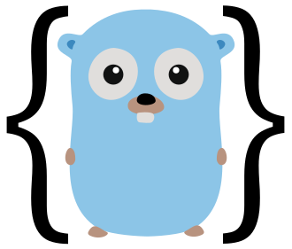

# go-gen-jsonschema 🧩

Generate Golang-friendly JSON schemas for structured LLM responses.

<p align="center">
  
</p>

Docs: https://go-gen-jsonschema.tylergannon.com

## 🔍 Overview

`go-gen-jsonschema` automatically generates JSON Schema definitions from your Go type definitions, optimized for LLM function calling (OpenAI, Anthropic, etc). It eliminates the need to manually write and maintain JSON schemas, keeping them perfectly in sync with your Go types.

Key benefits:

- ✨ **Automatic Schema Generation**: Convert Go structs directly to JSON Schema
- 🤖 **LLM-Friendly**: Designed for AI function calling use cases
- 🛡️ **Type Safety**: Ensure LLM responses match your Go types
- 🔄 **Compile-Time Validation**: Catch schema errors during build
- 🚀 **Runtime Support**: Load schemas during execution for LLM requests

## 📦 Installation

```bash
go install github.com/tylergannon/go-gen-jsonschema/gen-jsonschema@latest
```

## 🚀 Quickstart

This quickstart guide will walk you through setting up go-gen-jsonschema and implementing various schema types including basic types, enums, and union types via interfaces.

### 1. Set up your schema.go file

Create a `schema.go` file in your package with the following build tags and imports:

```go
//go:build jsonschema
// +build jsonschema

package yourpackage

import (
	"encoding/json"
	jsonschema "github.com/tylergannon/go-gen-jsonschema"
)
```

### 2. Define schema methods for your types

For each type that needs a JSON schema, add a `Schema()` method stub:

```go
func (YourType) Schema() json.RawMessage {
	panic("not implemented") // This will be replaced by the generator
}
```

### 3. Register your types with marker functions

Use the marker functions to register your types for schema generation:

```go
var (
	// Register schema methods for your types
	_ = jsonschema.NewJSONSchemaMethod(YourType.Schema)
	
	// For enums (string-based only for now)
	_ = jsonschema.NewEnumType[EnumType]()
	
	// For union types via interfaces
	_ = jsonschema.NewInterfaceImpl[YourInterface](Implementation1{}, Implementation2{}, (*PointerImplementation)(nil))
)
```

### 4. Create a generator

Create a folder named `gen` with a main.go file:

```go
package main

import (
	"log"
	
	"github.com/tylergannon/go-gen-jsonschema/gen-jsonschema/cmd"
)

func main() {
	if err := cmd.Execute(); err != nil {
		log.Fatal(err)
	}
}
```

### 5. Add a go:generate directive

In your types.go file, add:

```go
//go:generate go run ./gen
```

### 6. Generate your schemas

Run:

```bash
go generate ./...
```

The generator will create JSON schema files in a `jsonschema` directory and a `jsonschema_gen.go` file with functions to access these schemas at runtime.

## 🔧 Marker Functions Explained

`go-gen-jsonschema` uses marker functions to identify and configure types for schema generation.

### NewJSONSchemaMethod

```go
_ = jsonschema.NewJSONSchemaMethod(YourType.Schema)
```

This marker registers a struct method as a stub that will be implemented with a proper JSON schema. Use this for all types that need schemas.

### NewEnumType

```go
_ = jsonschema.NewEnumType[EnumType]()
```

Marks a type as an enum. This will generate an enum schema with all const values of this type defined in the same package. Currently only string-based enums are supported.

### NewInterfaceImpl (legacy) and v1 interface options

```go
// Legacy: global interface registration
_ = jsonschema.NewInterfaceImpl[YourInterface](Implementation1{}, Implementation2{}, (*PointerImplementation)(nil))

// v1 per-field options (recommended)
var _ = jsonschema.NewJSONSchemaMethod(
    ContainerType.Schema,
    jsonschema.WithInterface(ContainerType{}.Field),                       // mark a specific struct field as a discriminated union
    jsonschema.WithInterfaceImpls(ContainerType{}.Field, Impl1{}, Impl2{}), // explicit impl set
    jsonschema.WithDiscriminator(ContainerType{}.Field, "!kind"),          // per-field discriminator property name
)
```

- v1 options allow configuring union behavior per struct field, including a custom discriminator property used in both anyOf emission and generated unmarshaler code.
- You cannot mix legacy NewInterfaceImpl and v1 interface options in the same package.

### NewJSONSchemaBuilder

```go
_ = jsonschema.NewJSONSchemaBuilder[YourType](SchemaFunction)
```

Similar to NewJSONSchemaMethod but for standalone functions rather than struct methods.

## 📋 Examples

### 🔰 Basic Types

```go
// types.go
package example

type UserID int
type Username string

type User struct {
    ID       UserID   `json:"id"`
    Username Username `json:"username"`
    Email    string   `json:"email"`
}

// schema.go
//go:build jsonschema
// +build jsonschema

package example

import (
    "encoding/json"
    jsonschema "github.com/tylergannon/go-gen-jsonschema"
)

func (User) Schema() json.RawMessage {
    panic("not implemented")
}

var (
    _ = jsonschema.NewJSONSchemaMethod(User.Schema)
)
```

### Optional Attributes

By default all fields are considered _required_ and will be labeled as such in
the generated schema.  To make a field _optional_, mark it with a `jsonschema`
section in the struct tag:

```go
type User struct {
    ID       UserID   `json:"id"`
    Username Username `json:"username" jsonschema:"optional"`
    Email    string   `json:"email" jsonschema:"optional"`
}
```

The above configuration leads to the following schema:

```json
{
    "type": "object",
    "required": ["id"],
    "properties": {
        "id": {"type": "string"},
        "username": {"type": "string"},
        "email": {"type": "string"}
    }
}
```

### Optional Description

By default, struct fields will take their descriptions from the comments
attached to each field.  But you may attach a `description` struct tag to any
field if you prefer to have comments that do not translate into the schema.

```go
type User struct {
    // ID string for the user
    ID       UserID   `json:"id"`
    // Some notes specific to developers on the project
    Username Username `json:"username" jsonschema:"optional" description:"Instructions specific to the LLM prompt"`
    Email    string   `json:"email" jsonschema:"optional"`
}
```

Resulting JSON Schema

```json
{
    "type": "object",
    "required": ["id"],
    "properties": {
        "id": {"type": "string", "description": "ID string for the user"},
        "username": {"type": "string", "description": "Instructions specific to the LLM prompt"},
        "email": {"type": "string"}
    }
}
```

### $ref

By default, all nodes are expressed inline and none are moved into
`definitions`.  This naturally produces a requirement against cyclic types and
can produce a lot of repetition.

You can manually set a struct field to be represented as a ref in the output,
using the `jsonschema` tag element `ref`:

```go

type StructWithRefs struct {
	Ref1 StructType1 `json:"ref1" jsonschema:"optional,ref=definitions/StructType1"`
	Ref2 StructType2 `json:"ref2" jsonschema:"ref=definitions/StructType2"`
}

```

yields the following schema:

```json
{
  "type": "object",
  "properties": {
    "ref1": {
      "$ref": "definitions/StructType1"
    },
    "ref2": {
      "$ref": "definitions/StructType2"
    }
  },
  "required": [
    "ref2"
  ]
}
```

**NOTE** you have to define the referenced types manually.

### 🎯 Enum Types

Note: v1 introduces optional per-field enum configuration helpers (WithEnum, WithEnumMode(EnumStrings), WithEnumName), which will be documented post-v1. The legacy NewEnumType[Role]() remains supported.

```go
// types.go
package example

type Role string

const (
    RoleAdmin    Role = "admin"
    RoleUser     Role = "user"
    RoleGuest    Role = "guest"
)

type UserWithRole struct {
    Username string `json:"username"`
    Role     Role   `json:"role"`
}

// schema.go
//go:build jsonschema
// +build jsonschema

package example

import (
    "encoding/json"
    jsonschema "github.com/tylergannon/go-gen-jsonschema"
)

func (UserWithRole) Schema() json.RawMessage {
    panic("not implemented")
}

var (
    _ = jsonschema.NewJSONSchemaMethod(UserWithRole.Schema)
    _ = jsonschema.NewEnumType[Role]()
)
```

### 🔄 Union Types via Interfaces

```go
// types.go
package example

type PaymentMethod interface {
    IsPaymentMethod()
}

type CreditCard struct {
    CardNumber string `json:"cardNumber"`
    Expiry     string `json:"expiry"`
    CVV        string `json:"cvv"`
}

func (CreditCard) IsPaymentMethod() {}

type BankTransfer struct {
    AccountNumber string `json:"accountNumber"`
    RoutingNumber string `json:"routingNumber"`
}

func (BankTransfer) IsPaymentMethod() {}

type PayPal struct {
    Email string `json:"email"`
}

func (*PayPal) IsPaymentMethod() {}

type Payment struct {
    Amount        float64       `json:"amount"`
    PaymentMethod PaymentMethod `json:"paymentMethod"`
}

// schema.go
//go:build jsonschema
// +build jsonschema

package example

import (
    "encoding/json"
    jsonschema "github.com/tylergannon/go-gen-jsonschema"
)

func (Payment) Schema() json.RawMessage {
    panic("not implemented")
}

var (
    _ = jsonschema.NewJSONSchemaMethod(Payment.Schema)
    _ = jsonschema.NewInterfaceImpl[PaymentMethod](CreditCard{}, BankTransfer{}, (*PayPal)(nil))
)
```

## 🏗️ Manual Schema Construction

For when a statically generated schema just won't cut it, `go-gen-jsonschema`
provides a set of helper functions to manually build JSON schemas:

### 🔧 Core Schema Objects

```go
// JSONSchema - the main schema definition type
schema := &jsonschema.JSONSchema{
    Type:        jsonschema.Object,
    Description: "A user object",
    Properties: map[string]json.Marshaler{
        "username": jsonschema.StringSchema("User's username"),
        "age":      jsonschema.IntSchema("User's age"),
    },
    Required: []string{"username"},
    AdditionalProperties: false,
}

// Use the Strict field to automatically set additionalProperties: false
// and make all properties required
strictSchema := &jsonschema.JSONSchema{
    Type:        jsonschema.Object,
    Description: "A user with strict validation",
    Properties: map[string]json.Marshaler{
        "username": jsonschema.StringSchema("User's username"),
        "email":    jsonschema.StringSchema("User's email"),
    },
    Strict: true, // Automatically adds all properties to Required and sets AdditionalProperties to false
}
```

### 📝 Basic Schemas

```go
// Create primitive type schemas
stringSchema := jsonschema.StringSchema("A string description")
boolSchema := jsonschema.BoolSchema("A boolean description")
intSchema := jsonschema.IntSchema("An integer description")
```

### 🌟 Specialized Schemas

```go
// Create an array schema
arraySchema := jsonschema.ArraySchema(stringSchema, "An array of strings")

// Create an enum schema
roleSchema := jsonschema.EnumSchema("User role", "admin", "user", "guest")

// Create a const schema (fixed value)
adminSchema := jsonschema.ConstSchema("admin", "Administrator role")

// Create a reference to another schema
refSchema := jsonschema.RefSchemaEl("#/$defs/Role")

// Create a union type (anyOf)
unionSchema := jsonschema.UnionSchemaEl(stringSchema, intSchema)
```

## 💻 Command Line Usage

### 🔨 Generate Schemas

```bash
go-gen-jsonschema gen [options]
```

Options:
- `-target string`: Path to target package (defaults to current directory)
- `-pretty`: Enable pretty-printed JSON output
- `-no-gen-test`: Disable test sample generation
- `-num-test-samples int`: Number of test samples to generate (default 5)
- `-no-changes`: Fail if any schema changes are detected
- `-force`: Force regeneration of schemas even if no changes detected

### 🆕 Create a New Project

```bash
go-gen-jsonschema new [options]
```

Options:
- `-out string`: Path to output file (empty or "--" means print to stdout)
- `-pkg string`: Package name for generated file (defaults to current directory)
- `-methods string`: Comma-separated list of methods to generate (format: TypeName=MethodName,TypeName2=MethodName2)

## ✨ Features

- 📝 **Doc Comment Support**: Comments become schema descriptions
- 🏷️ **JSON Tag Integration**: Respects json struct tags
- 🔒 **Type Safety**: Generates Go-compatible schemas
- 🔌 **Custom Transformers**: Extensible for special types
- ⏰ **Time Handling**: Proper formatting for time.Time
- 🧪 **Test Data Generation**: Sample data for validation

## 🛠️ Development

Build from source:

```bash
git clone https://github.com/tylergannon/go-gen-jsonschema.git
cd go-gen-jsonschema
go build ./gen-jsonschema
```

## 📄 License

[License information]

## 👥 Contributing

Contributions welcome! Please see [contributing guidelines] for more information. 
