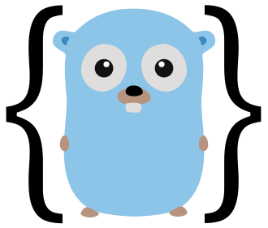

# go-gen-jsonschema 🧩

Generate JSON Schemas from Go types — built for LLM function calling and
structured output (Anthropic tool use, OpenAI tools).

<p align="center">
  
</p>

- **Docs**: https://go-gen-jsonschema.tylergannon.com
- **LLM/agent-friendly docs**: [llms.txt](llms.txt)
- **Agent skill**: [skills/go-gen-jsonschema](skills/go-gen-jsonschema/SKILL.md)

## 🚀 Quick Start

### Using an AI coding agent?

Install the agent skill first — it teaches Claude Code, Cursor, Codex, and
friends the full workflow (setup, registration API, doc-comment conventions,
git-hook integration):

```bash
npx skills add tylergannon/go-gen-jsonschema
```

Then just ask your agent to "add go-gen-jsonschema to this project."

### Setting up by hand

1. **Add the tool to your module** (Go 1.24+; pins the version in go.mod so
   every contributor and CI runs the same binary):

   ```bash
   go get -tool github.com/tylergannon/go-gen-jsonschema/gen-jsonschema@latest
   ```

   <details><summary>Alternative: global install</summary>

   ```bash
   go install github.com/tylergannon/go-gen-jsonschema/gen-jsonschema@latest
   ```

   Then use `gen-jsonschema` instead of `go tool gen-jsonschema` everywhere below.
   </details>

2. **Add a generate directive** next to your types (include `--validate` if
   you want generated `ValidateJSON()` methods):

   ```go
   //go:generate go tool gen-jsonschema --validate
   ```

3. **Scaffold the registration file and generate:**

   ```bash
   go tool gen-jsonschema new -out schema.go -methods 'Person=Schema' --validate --generate
   go mod tidy   # needed with --validate: generated code imports santhosh-tekuri/jsonschema/v6
   ```

4. **Use the generated methods:**

   ```go
   schema := Person{}.Schema()          // json.RawMessage — drop into your tool definition
   err := Person{}.ValidateJSON(data)   // validate LLM output before json.Unmarshal
   ```

Commit everything the generator writes: `jsonschema_gen.go` and the
`jsonschema/` directory (schemas plus `.json.sum` checksums).

## 🔍 Why this tool

- **Deterministic property ordering** — properties are emitted in struct field
  order, so you control schema layout precisely. Property order influences LLM
  output quality; most generators iterate maps and produce random order.
- **Schemas can't drift** — change a struct, run `go generate`, done. Wire it
  into a pre-commit hook or CI (see below) and drift becomes impossible.
- **LLM-optimized defaults** — `additionalProperties: false`, ordinary and
  nullable fields required, `Optional[T]` fields optional, and doc comments
  become `description` fields.
- **Built-in validation** — opt-in `ValidateJSON()` methods with schemas
  compiled once at startup, returning structured errors.

## ⚙️ How it works

The tool keeps registration code out of your production build with a pair of
mutually exclusive build-tagged files:

| File | Build tag | Who writes it | Contents |
|---|---|---|---|
| `schema.go` | `//go:build jsonschema` | You | Panic stubs + marker registrations; compiled only during generation |
| `jsonschema_gen.go` | `//go:build !jsonschema` | Generated | Real `Schema()` / `ValidateJSON()` over an embedded `jsonschema/` directory |

Your package compiles at every stage — before generation (stubs) and after
(generated implementations).

```go
// types.go
package contacts

import jsonschema "github.com/tylergannon/go-gen-jsonschema"

//go:generate go tool gen-jsonschema --validate

// Person is a single contact extracted from the document.
type Person struct {
    // Full legal name, e.g. "Ada Lovelace".
    Name string `json:"name"`

    // Age in whole years at the time of writing.
    Age int `json:"age"`

    // Email address. Omit when not stated in the source text.
    Email jsonschema.Optional[string] `json:"email,omitzero"`

    // Phone number. Emit null when the source explicitly has no phone number.
    Phone jsonschema.Nullable[string] `json:"phone"`
}
```

```go
// schema.go
//go:build jsonschema

package contacts

import (
    "encoding/json"
    jsonschema "github.com/tylergannon/go-gen-jsonschema"
)

// Stubs so the package compiles before generation.
func (Person) Schema() json.RawMessage     { panic("not implemented") }
func (Person) ValidateJSON(_ []byte) error { panic("not implemented") }

var _ = jsonschema.NewJSONSchemaMethod(Person.Schema)
```

`go generate ./...` produces `jsonschema/Person.json`:

```json
{
  "type": "object",
  "description": "Person is a single contact extracted from the document.",
  "properties": {
    "name": {"type": "string", "description": "Full legal name, e.g. \"Ada Lovelace\"."},
    "age": {"type": "integer", "description": "Age in whole years at the time of writing."},
    "email": {"type": "string", "description": "Email address. Omit when not stated in the source text."},
    "phone": {"type": ["string", "null"], "description": "Phone number. Emit null when the source explicitly has no phone number."}
  },
  "required": ["name", "age", "phone"],
  "additionalProperties": false
}
```

## ✍️ Doc comments become descriptions

Field and type doc comments are copied into the schema's `description` fields —
the text the LLM reads when filling in values. Write them as instructions to
the model: formats, units, ranges, when to omit. To keep a developer-facing
comment out of the schema, supply a `description` struct tag instead:

```go
type User struct {
    // Developer notes stay here and never reach the LLM.
    Username string `json:"username" description:"The user's unique handle, lowercase, no spaces."`
}
```

## 🏷️ Struct tag reference

| Tag | Effect |
|---|---|
| `json:"name"` | Property name (standard Go semantics) |
| `json:",omitzero"` | Required on `Optional[T]`; omits the wrapper's absent zero value |
| `description:"..."` | Overrides the doc comment as the property description |
| `jsonschema:"ref=definitions/T"` | Emit a `$ref` instead of inlining (you must define the referenced schema yourself) |

Use `jsonschema.Optional[T]` when a property may be absent and must not be
null. Use `jsonschema.Nullable[T]` when the property is required but may be
null. Both wrappers expose `Present` and `Value`; present zero and empty values
remain distinguishable from absence/null. Plain `json.Unmarshal` cannot tell a
missing Nullable key from an explicit null, so call generated `ValidateJSON`
before decoding when required-key presence matters.

For OpenAI strict Structured Outputs, every property must be required. Use
`Nullable[T]` for OpenAI's documented required-plus-null pattern; a schema with
`Optional[T]` is not strict-compatible because that property is not required.
See the [Structured Outputs guide](https://developers.openai.com/api/docs/guides/structured-outputs#all-fields-must-be-required).

V1 `Optional` supports scalar and named scalar values, structs, pointers,
arrays/slices, explicit supported refs, and registered interfaces. V1 `Nullable`
supports scalars, structs, and pointers to structs. Wrappers must be the complete
type of a direct named field; aliases, nesting, embedding, and unsupported
Nullable shapes fail generation.

Migration note: `jsonschema:"optional"` is no longer honored. Replace it with
`jsonschema.Optional[T]` and add `json:",omitzero"`; otherwise the field is
required when schemas are regenerated.

By default nested struct types are **inlined** at every use site — no `$defs`,
no `$ref` — which is what LLM APIs handle best.

## 🎯 Enums

String enums: values are auto-discovered from `const` declarations of the
type (same package). Integer/iota enums: `WithStringerEnum` emits the constant
*names* as string values — far more meaningful to an LLM than raw integers.

```go
type Status string

const (
    StatusPending    Status = "pending"
    StatusInProgress Status = "in_progress"
    StatusCompleted  Status = "completed"
)

type LogLevel int

const (
    LogDebug LogLevel = iota
    LogInfo
    LogError
)

type Task struct {
    Status   Status   `json:"status"`
    LogLevel LogLevel `json:"logLevel"`
}
```

```go
// schema.go (//go:build jsonschema)
var _ = jsonschema.NewJSONSchemaMethod(
    Task.Schema,
    jsonschema.WithEnum(Task{}.Status),          // ["pending", "in_progress", "completed"]
    jsonschema.WithStringerEnum(Task{}.LogLevel), // ["LogDebug", "LogInfo", "LogError"]
)
```

The legacy package-level form `jsonschema.NewEnumType[Status]()` remains
supported.

## 🔄 Union types (interfaces)

An interface-typed field becomes an `anyOf` union of its registered
implementations, discriminated by a `"!type"` property (configurable). The
generator also emits an `UnmarshalJSON` on the containing struct that
dispatches on the discriminator.

```go
type PaymentMethod interface{ IsPaymentMethod() }

type CreditCard struct {
    CardNumber string `json:"cardNumber"`
    Expiry     string `json:"expiry"`
}
func (CreditCard) IsPaymentMethod() {}

type BankTransfer struct {
    AccountNumber string `json:"accountNumber"`
    RoutingNumber string `json:"routingNumber"`
}
func (BankTransfer) IsPaymentMethod() {}

type Payment struct {
    Amount float64       `json:"amount"`
    Method PaymentMethod `json:"method"`
}
```

```go
// schema.go (//go:build jsonschema)
var _ = jsonschema.NewJSONSchemaMethod(
    Payment.Schema,
    jsonschema.WithInterface(Payment{}.Method),
    jsonschema.WithInterfaceImpls(Payment{}.Method, CreditCard{}, BankTransfer{}),
    jsonschema.WithDiscriminator(Payment{}.Method, "!kind"), // optional; default "!type"
)
```

The legacy package-level form is still supported, but cannot be mixed with the
per-field options above in the same package:

```go
var _ = jsonschema.NewInterfaceImpl[PaymentMethod](CreditCard{}, BankTransfer{})
```

Note: arrays of interface types (`[]PaymentMethod`) are not supported — use a
single interface field.

## 🛡️ Validation

Pass `--validate` to generation (and to `new`, so stubs match) and every
registered type gets a `ValidateJSON([]byte) error` method. Schemas are
compiled once in `init()` via
[santhosh-tekuri/jsonschema](https://github.com/santhosh-tekuri/jsonschema).

```go
if err := (Person{}).ValidateJSON(llmOutput); err != nil {
    // *jsonschema.ValidationError with structured details:
    //   err.InstanceLocation — path to the failing field
    //   err.ErrorKind        — what went wrong
    //   err.Causes           — nested validation errors
    return err
}
var p Person
json.Unmarshal(llmOutput, &p)
```

Validation catches missing required fields, wrong types, unknown properties,
invalid enum values, and bad nested structure — before you unmarshal. Types
using `WithRenderProviders()` are excluded (their schemas depend on runtime
values).

## 🔁 Keeping schemas in sync (hooks & CI)

Generation supports a check mode that fails — writing nothing — when
regeneration would change any schema: `-no-changes`, or the env var
`JSONSCHEMA_NO_CHANGES=1` (which flows through `go generate` without editing
directives).

```yaml
# lefthook.yml — fail the commit on schema drift
pre-commit:
  commands:
    gen-jsonschema-check:
      glob: "*.go"
      run: JSONSCHEMA_NO_CHANGES=1 go generate ./...
```

```yaml
# GitHub Actions — same guarantee in CI
- name: Check generated schemas are current
  run: JSONSCHEMA_NO_CHANGES=1 go generate ./...
```

Prefer auto-regenerating in the hook instead of failing? See
[the agent skill's hooks guide](skills/go-gen-jsonschema/references/hooks-and-ci.md)
for the auto-stage variant and trade-offs.

## 📖 Registration API

| Marker | Purpose |
|---|---|
| `NewJSONSchemaMethod(T.Schema, ...opts)` | Primary registration — one call per type |
| `NewJSONSchemaFunc(fn, ...opts)` | Register a free function instead of a method |
| `NewJSONSchemaBuilder[T](fn)` | Register a `SchemaFunction` returning a manually built schema |
| `NewEnumType[T]()` | Legacy enum registration (prefer `WithEnum`) |
| `NewInterfaceImpl[I](impls...)` | Legacy union registration (prefer `WithInterface*`) |

Options for `NewJSONSchemaMethod` / `NewJSONSchemaFunc`: `WithEnum(field)`,
`WithStringerEnum(field)`, `WithInterface(field)`,
`WithInterfaceImpls(field, impls...)`, `WithDiscriminator(field, name)`,
`WithRenderProviders()`.

These markers are no-ops at runtime — the generator reads them from the AST of
your build-tagged `schema.go`.

## 💻 CLI reference

```
gen-jsonschema [gen] [options]     # generate (default subcommand)
  -target DIR          package to process (default: current directory)
  -pretty              pretty-print the .json output
  -no-changes          fail, writing nothing, if regeneration would change any schema
  -force               rewrite even when unchanged (incompatible with -no-changes)
  -num-test-samples N  number of test samples to generate (default 5)
  --validate           also generate ValidateJSON() methods

gen-jsonschema new [options]       # scaffold schema.go
  -out FILE            output path ("" or "--" = stdout)
  -pkg NAME            package name override (stdout mode)
  -methods 'T=Schema,U=Schema'     types to register (required)
  --validate           include ValidateJSON stubs
  --generate           run `go generate ./...` afterward
```

Environment: `JSONSCHEMA_NO_CHANGES` (any non-empty value) ≡ `-no-changes`.

## 🏗️ Manual schema construction

When a statically generated schema won't cut it, build one with the helper
types (see [json_schema.go](json_schema.go)):

```go
schema := &jsonschema.JSONSchema{
    Type:        jsonschema.Object,
    Description: "A user object",
    Properties: map[string]json.Marshaler{
        "username": jsonschema.StringSchema("User's username"),
        "age":      jsonschema.IntSchema("User's age"),
    },
    Strict: true, // all properties required + additionalProperties: false
}
```

Helpers: `StringSchema`, `BoolSchema`, `IntSchema`, `ArraySchema`,
`EnumSchema`, `ConstSchema`, `RefSchemaEl`, `UnionSchemaEl`.

`JSONSchema`'s map-based `Properties` marshal in alphabetical key order. When
you need properties emitted in a specific order (the whole point for LLM
prompting), use `ObjectSchema` and add fields with `AddProperty` /
`AddRequiredProperty` — it preserves insertion order.

## ⚠️ Limitations

- No map types, channels, functions, or inline interfaces
- No circular/recursive type references (detected and rejected)
- No arrays of interface types (use a single interface field)
- External package types unsupported, except `time.Time` (rendered as a string
  with RFC3339 guidance)
- Max nesting depth: 100

## 🛠️ Development

```bash
git clone https://github.com/tylergannon/go-gen-jsonschema.git
cd go-gen-jsonschema
go build ./gen-jsonschema
go test ./...
just lint    # task runner is `just`
```
