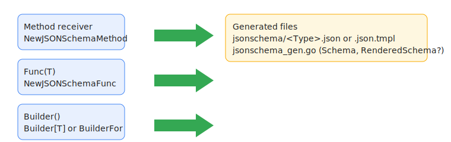
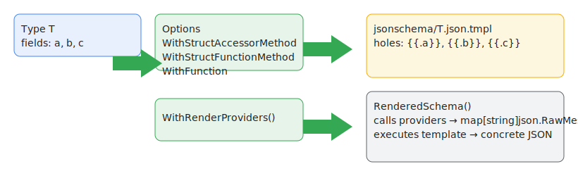
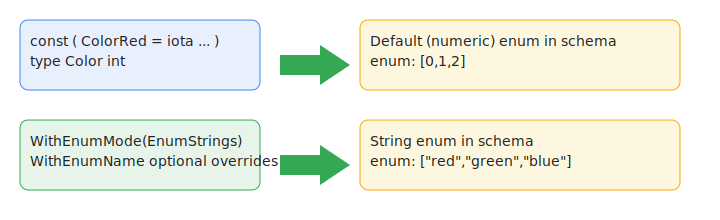
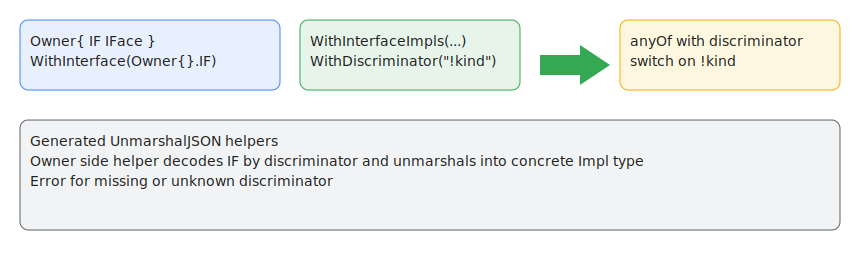

# go-gen-jsonschema Tutorial (v1 draft)

This tutorial walks through the v1 contract using runnable examples from the repo. It mirrors the Spec and points to concrete code you can run.

Prereqs
- Go ≥ 1.21 (dev on 1.24.x)
- Module mode

Quickstart
1) Add a schema entry point for a type.
2) Run the generator in your module (via `go:generate` or the `gen-jsonschema` helper).
3) Use the generated `jsonschema/*.json` at build time, or the generated `(T) Schema()`/`RenderedSchema()` at runtime.

Entry points (choose one)



- Method receiver (existing)
  - Example: internal/builder/testfixtures/basictypes/schema.go
  - Pattern:
    ```go
    func (T) Schema() json.RawMessage { panic("not implemented") }
    var _ = jsonschema.NewJSONSchemaMethod(T.Schema)
    ```
- Free function with receiver param (new)
  - Example: internal/builder/testfixtures/entrypoints/schema.go
  - Pattern:
    ```go
    func TSchema(T) json.RawMessage { panic("not implemented") }
    var _ = jsonschema.NewJSONSchemaFunc[T](TSchema)
    ```
- Zero‑arg builder function (new)
  - Generic form (back‑compat and constraints):
    ```go
    func TSchema() json.RawMessage { panic("not implemented") }
    var _ = jsonschema.NewJSONSchemaBuilder[T](TSchema)
    ```
  - Non‑generic convenience (type inferred from example value):
    - Example: internal/builder/testfixtures/entrypoints/schema.go
    ```go
    var _ = jsonschema.NewJSONSchemaBuilderFor(T{}, TSchema)
    ```

Consolidated options
Attach options to the registration call.

Providers (field schema overrides)



- Examples:
  - Integration fixture: internal/builder/testfixtures/providers
  - Tutorial example: examples/v1/providers_rendering
- API:
  ```go
  jsonschema.WithStructAccessorMethod(Owner{}.Field, (Owner).Method)
  jsonschema.WithStructFunctionMethod(Owner{}.Field, (Owner).Method)
  jsonschema.WithFunction(Owner{}.Field, FreeFunc)
  jsonschema.WithRenderProviders() // generates RenderedSchema() and .json.tmpl
  ```
- Behavior:
  - Without `WithRenderProviders()`: generator writes `jsonschema/Type.json.tmpl` if any provider is present; generated `(T) Schema()` returns template bytes.
  - With `WithRenderProviders()`: generator also emits `(T) RenderedSchema() (json.RawMessage, error)` that executes providers and renders the template into concrete JSON.

Enums (including iota)



- Examples:
  - Legacy: internal/builder/testfixtures/enums
  - String mode (tutorial): examples/v1/enums_stringmode
- API (v1):
  ```go
  jsonschema.WithEnum(Owner{}.EnumField)
  jsonschema.WithEnumMode(jsonschema.EnumStrings)
  // optional per-const: jsonschema.WithEnumName(ConstValue, "name")
  ```
- Behavior:
  - Default numeric mode uses underlying values.
  - String mode names resolve in order: WithEnumName > T.String() > const identifier; duplicates error.

Interfaces (discriminated unions)



- Examples:
  - Legacy: internal/builder/testfixtures/interfaces
  - v1 options: examples/v1/interfaces_options
- API (v1):
  ```go
  jsonschema.WithInterface(Owner{}.IF)
  jsonschema.WithInterfaceImpls(Owner{}.IF, Impl1{}, Impl2{})
  jsonschema.WithDiscriminator(Owner{}.IF, "!kind")
  ```
- Behavior:
  - Discriminator default is "!type"; override per field.
  - Owner-side UnmarshalJSON helpers are generated to decode unions by discriminator.
  - Field must be direct interface type (not nested in slices/maps/parens); illegal placements error with position.

Generation outputs
- Files:
  - `jsonschema/<Type>.json` for normal types
  - `jsonschema/<Type>.json.tmpl` when providers are configured
- Generated methods (per registered type):
  - `func (T) Schema() json.RawMessage`
  - `func (T) RenderedSchema() (json.RawMessage, error)` (only with `WithRenderProviders()`)

Running the generator
- Each example/fixture has `//go:generate go run ./gen` and a minimal `gen/main.go` that calls `internal/builder.Run`.
- In your module, add the same and run:
  - `go generate ./...`
  - or use the `gen-jsonschema` CLI (optional).

Determinism & diagnostics
- Pretty JSON, trailing newline, content-addressed checksums to avoid unnecessary writes.
- Errors include file:line and suggested fixes.

Where to look in this repo
- Spec: docs/spec/v1.md (authoritative contract)
- Tutorial: docs/tutorial.mdx (this file)
- Integration examples as tests: internal/builder/testfixtures/*
- Additional runnable samples: examples/v1/*

What’s next
- Provider rendering fixture and interface/enum option fixtures are being expanded to fully exercise v1 behaviors; keep both this tutorial and the Spec in sync with examples.
